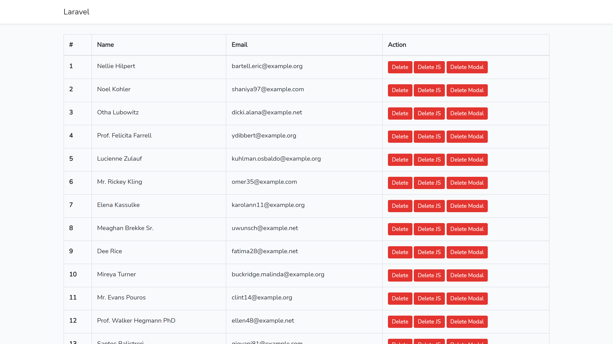
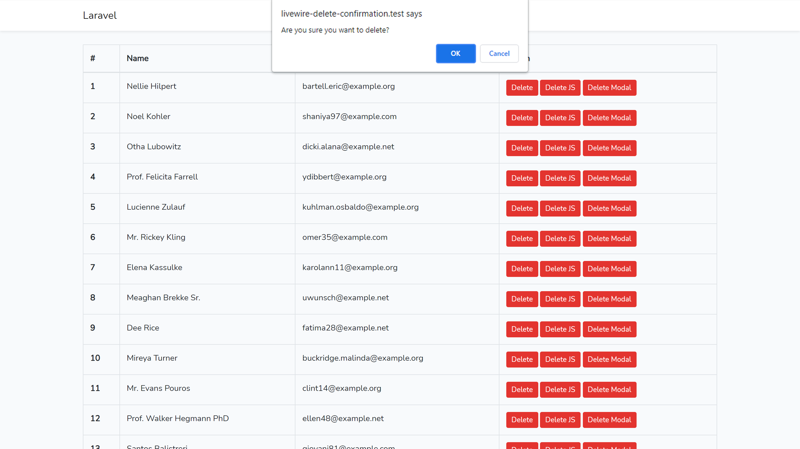
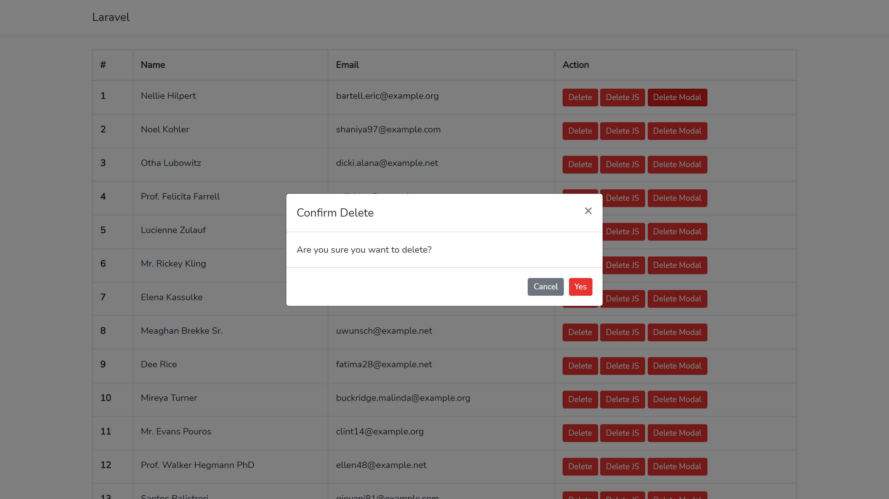

# Livewire Delete Confirmation

## Requirements

- Laravel 8.x
- \>= PHP 7.3
- Livewire 2.5

## Installation

```
git clone https://github.com/livewire-delete-confirmation.git
cd livewire-delete-confirmation
composer install
cp .env.example .env
php artisan key:generate
php artisan migrate --seed
```

## Screenshots

### Default


### Javascript Confirm Alert


### Modal Popup
